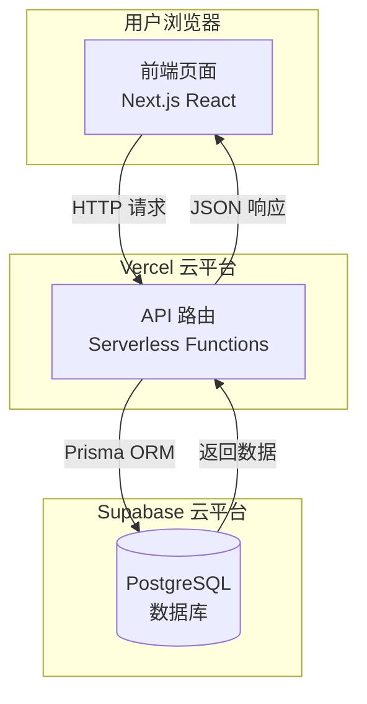
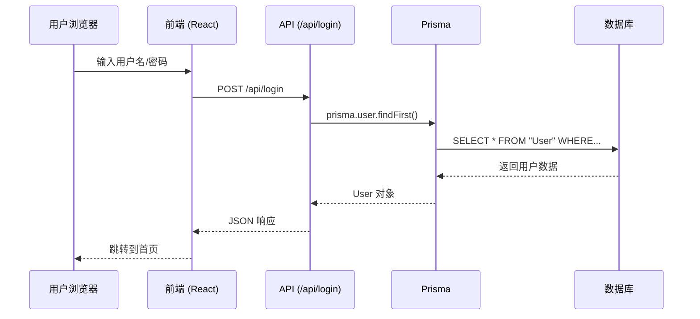

# 社群会员管理系统 - 技术架构总结

## 🎯 项目概览

您成功部署了一个**全栈 Web 应用**，它由以下几个部分组成：



---

## 🏗️ 技术栈详解

| 层级 | 技术 | 作用 |
|------|------|------|
| **前端** | Next.js + React | 用户界面、页面路由 |
| **后端** | Next.js API Routes | 处理业务逻辑、数据库操作 |
| **ORM** | Prisma | 连接数据库、生成 SQL |
| **数据库** | PostgreSQL (Supabase) | 存储用户、商户数据 |
| **部署** | Vercel | 托管前端和后端 |

---

## 📁 项目结构

```
web-coding/
├── src/
│   ├── app/                    # Next.js 应用目录
│   │   ├── page.tsx           # 首页 (会员卡)
│   │   ├── login/             # 登录页面
│   │   ├── admin/             # 管理后台
│   │   ├── store/[storeId]/   # 商家扫码页
│   │   └── api/               # 后端 API 路由 ⭐
│   │       ├── login/         # POST /api/login
│   │       ├── users/         # GET/POST /api/users
│   │       └── merchants/     # GET /api/merchants
│   ├── context/               # React 状态管理
│   └── lib/                   # 工具库 (Prisma 客户端)
├── prisma/
│   └── schema.prisma          # 数据库模型定义 ⭐
└── package.json               # 项目依赖
```

---

## 🔄 数据流动示例

### 用户登录流程



---

## 🌐 部署架构

### 本地开发 vs 云端部署

| 环境 | 前端 | 后端 | 数据库 |
|------|------|------|--------|
| **本地开发** | localhost:3000 | localhost:3000/api | 本地 PostgreSQL 或 Docker |
| **云端部署** | Vercel CDN | Vercel Serverless | Supabase Cloud |

### 关键配置项

1. **DATABASE_URL** - 数据库连接字符串
   ```
   postgresql://用户名:密码@主机:端口/数据库名
   ```

2. **Supabase 连接模式**
   - **Direct Connection** (端口 5432): 仅支持 IPv6
   - **Transaction Pooler** (端口 6543): 支持 IPv4 ✅ (Vercel 需要这个)

---

## 🐛 本次遇到的问题及解决方案

| 问题 | 原因 | 解决方案 |
|------|------|----------|
| 构建失败 (TypeScript) | 类型定义不匹配 | 添加类型断言 `as any` |
| 数据库连不上 | IPv4 不兼容 | 切换到 Transaction Pooler |
| API 500 错误 | Prepared statements 不支持 | 添加 `?pgbouncer=true` 参数 |

---

## 📚 关键概念解释

### 什么是 API Route？
API Route 是后端代码，运行在服务器上。前端通过 HTTP 请求调用它们。

```typescript
// src/app/api/login/route.ts
export async function POST(request: Request) {
    const { username, password } = await request.json();
    const user = await prisma.user.findFirst({ where: { username, password } });
    return NextResponse.json(user);
}
```

### 什么是 Prisma？
Prisma 是一个 ORM（对象关系映射），把 JavaScript/TypeScript 代码转换成 SQL。

```typescript
// 这行 Prisma 代码...
await prisma.user.findFirst({ where: { username: 'admin' } });

// 会被转换成这条 SQL...
SELECT * FROM "User" WHERE username = 'admin' LIMIT 1;
```

### 什么是 Serverless？
Vercel 的后端是 "Serverless"（无服务器）的，意味着代码不会一直运行，而是按需启动。这就是为什么需要使用连接池 (Pooler) 来管理数据库连接。

---

## 🎉 恭喜完成！

您现在拥有一个完整的全栈应用：
- 🌐 线上地址: [anti-community-membership-system.vercel.app](https://anti-community-membership-system.vercel.app)
- 👤 管理员账号: `admin` / `admin`
- 👤 测试普通用户: `testuser` / `123`

如有任何问题，随时问我！
